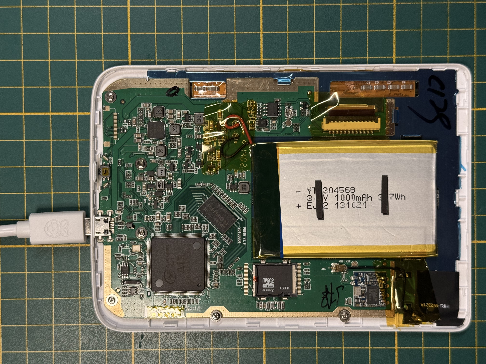
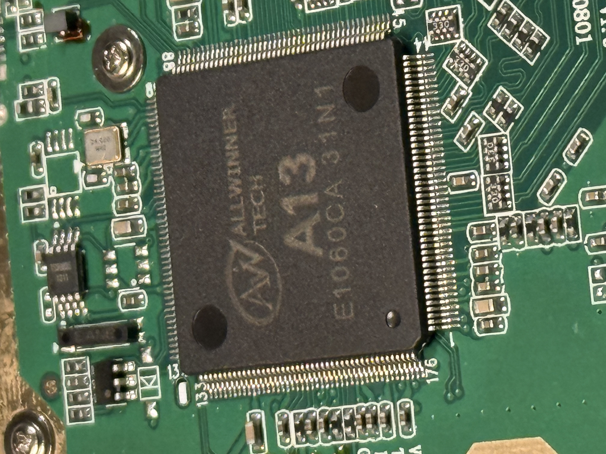
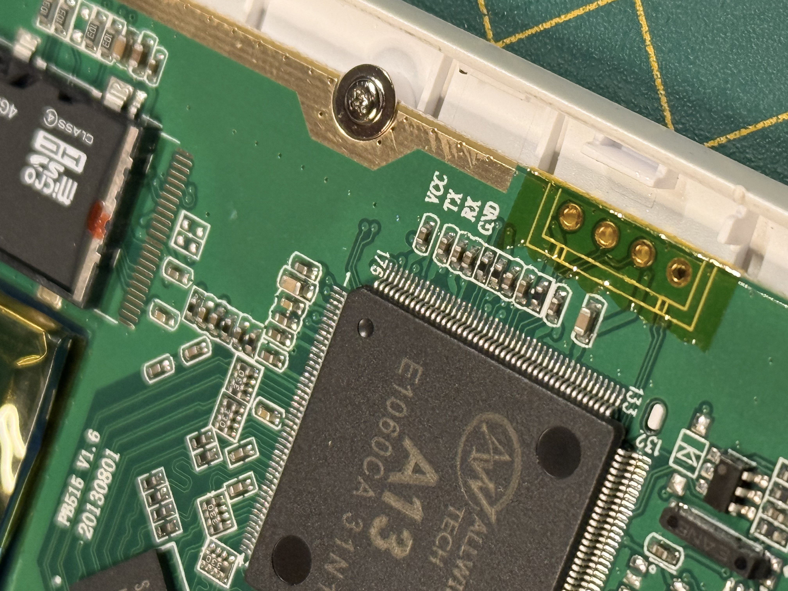
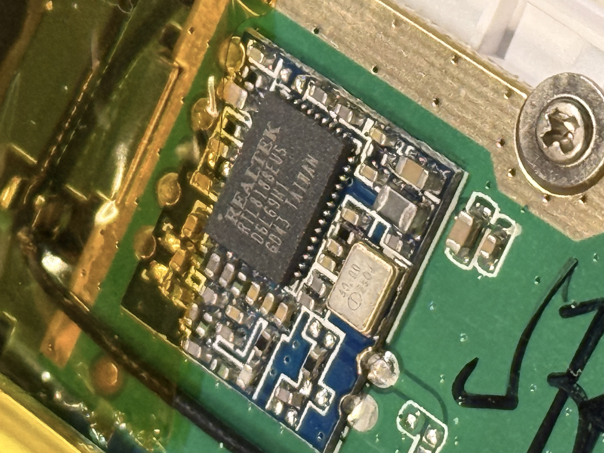
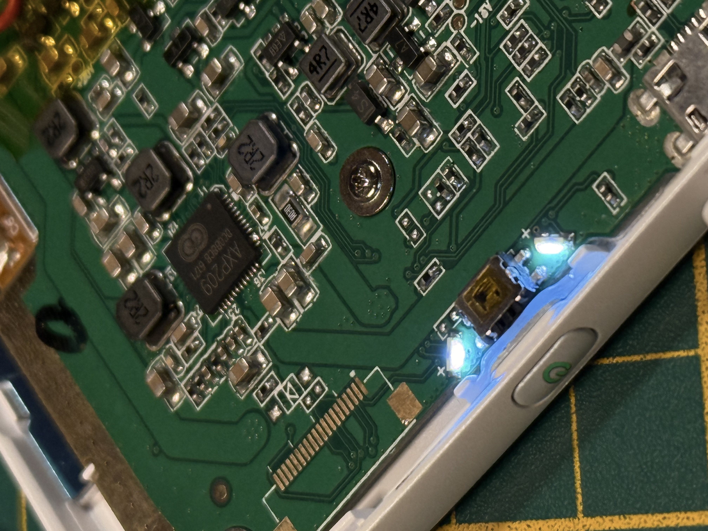
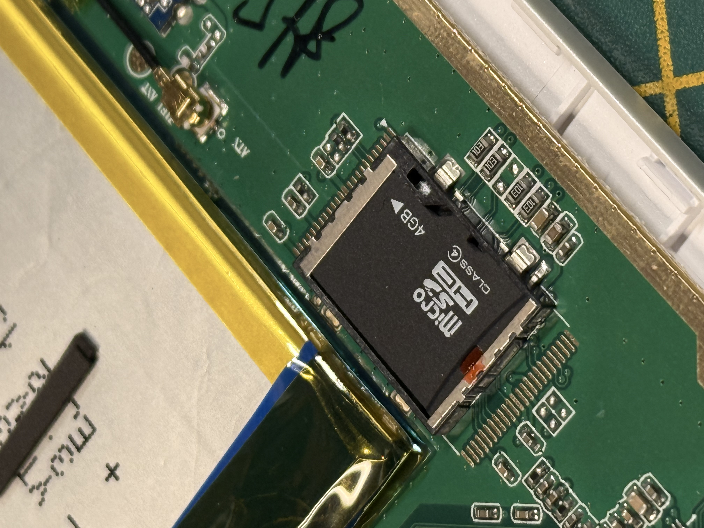
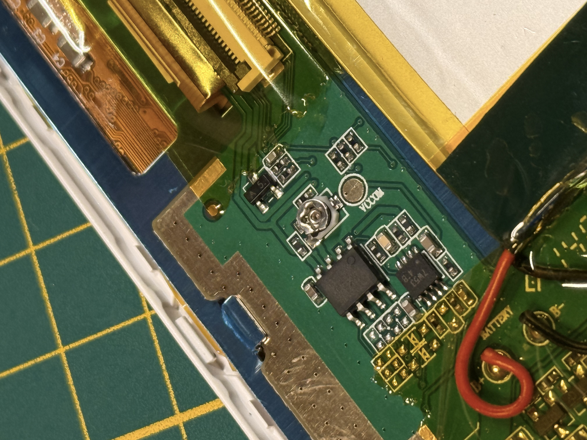
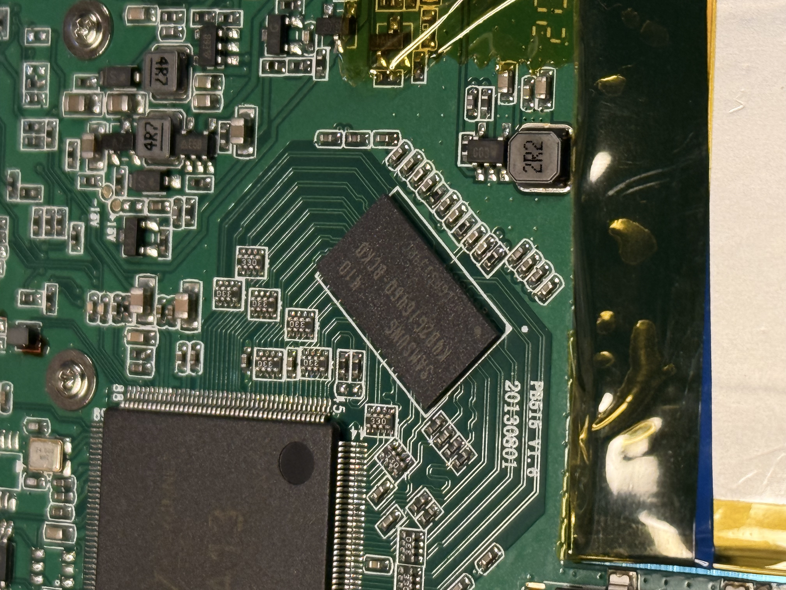
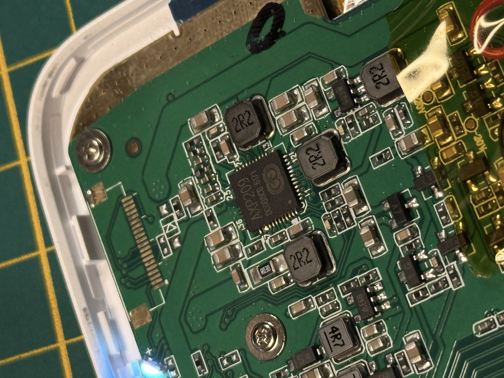
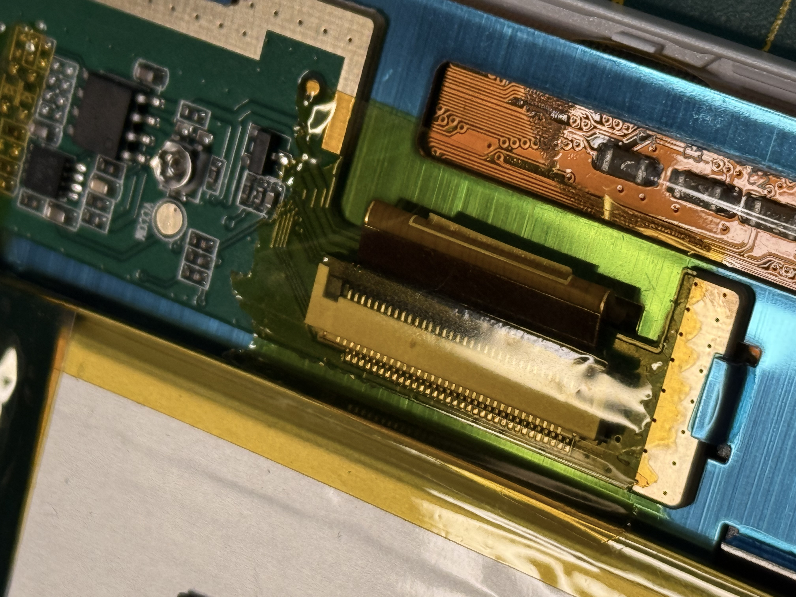

# PocketBook Mini 515 - Mainline Linux Exploration

My attempt to put a current mainline kernel + U-Boot on a PocketBook Mini 515 e-reader. Most of it works - booting, MMC, RTC, PMIC, buttons, USB. The one big thing that **doesn't** work (and most likely won't) is the e-ink display itself. This document is half "how I did it" and half "here is everything I learned about the hardware so the next person can finish the job".


## Status

| Subsystem | Stock kernel (3.0.8) | Mainline (v7.0) |
|---|---|---|
| Boot from internal SD (MMC2) | yes | **yes** |
| UART console | yes | **yes** |
| AXP209 PMIC + battery | yes | **yes** |
| PCF8563 RTC | yes | **yes** |
| GPIO + LRADC buttons | yes | **yes** |
| USB OTG (gadget mode) | yes | **yes** |
| Mali-400 GPU (lima) | no | **yes** (probes - untested) |
| E-Ink display | yes | **no** - see [E-Ink](#e-ink-the-bit-that-doesnt-work-yet) |
| WiFi | yes | **no** |

## The repos

This writeup pulls from:

| Repo | What's in it |
|---|---|
| [`pkoscik/pb515-bsp`](https://github.com/pkoscik/pb515-bsp) | Buildroot-based BSP  |
| [`pkoscik/linux`](https://github.com/pkoscik/linux) | Linux kernel fork with basic PB515 support added |
| [`pkoscik/u-boot`](https://github.com/pkoscik/u-boot) | U-Boot fork with `pocketbook-515_defconfig` |

## Hardware overview

Everything below was extracted from `script.bin` (Allwinner's "Fex" board description blob) pulled off the factory SD card, cross-referenced with the live `dmesg` from the stock kernel.

| Component | Detail |
|---|---|
| SoC | Allwinner A13 (sun5i), single-core Cortex-A8 @ 1008 MHz |
| RAM | 256 MiB DDR3 (Samsung K4B2G1646Q), 408 MHz |
| PMIC | AXP209 on I2C-0 @ 0x34 |
| RTC | PCF8563 on I2C-1 @ 0x51 |
| Display | ED050SC5 - 5" E-Ink Vizplex, 600x800 |
| EPDC | **Software** EPDC via the A13's DEBE + TCON0 - **there is no dedicated e-ink controller chip on this board** |
| Storage | Internal microSD (MMC2) |
| WiFi | Realtek RTL8188EU |
| Touch / frontlight | None |
| Buttons | 3x LRADC + 2x GPIO |
| UART | UART1 (PG3 / PG4) @ 115200 - debug console |
| USB | OTG (sw_hcd0 / musb), capable of host or gadget |

The full GPIO map I reverse engineered out of the stock script.bin lives in [`docs/GPIO_PINMAP.md`](docs/GPIO_PINMAP.md).

## Initial teardown

A plastic spudger around the rim. The back shell pops off pretty easily - nothing is glued (besides the eInk display and front bezel).

<details>

<summary>Teardown images</summary>












</details>

A few notable points:

- The "internal storage" is literally a microSD card seated in an SMT card holder. You can (try to) lever it out. ((**Don't**)) ((Foreshadowing))
- The A13 sits on a small daughter PCB with the DDR3 chip on its back side.
- UART test points are clearly labelled (TX / RX / GND) on the rear of the PCB.

## Getting a UART console

Three gold-pin pads at the rear of the PCB. **The screen ribbon shielding blocks the third pin** from fitting a standard 0.1" header - you have to either solder wires directly, bend the pin, or hold the header at an angle while soldering.

Hook up at **115200 8N1** to UART1 (TX = PG3, RX = PG4, silkscreen labels are correct). Power on the device and you should immediately see the Allwinner boot ROM banner:

```
dram size =256
0xffffffff,0xffffffff
super_standby_flag = 0
HELLO! BOOT0 is starting!
boot0 version : 1.5.0
The size of Boot1 is 0x00038000.
Succeed in loading boot1 from sdmmc flash.
...
[       0.473] 0x40008000 0x003c1fc4 c:\linux\bImage
```

So the stock boot chain is **BROM -> boot0 (eGON) -> boot1 -> boot.axf -> bImage (Linux 3.0.8)**.

> also `c:\linux\bImage`, lol

## Stock OS exploration

Getting "root" turned out to be the easiest part: when the BusyBox `init` is starting and the script invokes `/etc/init.d/rcS`, spamming **Enter** on the UART before the eReader app launches lands you in an interactive sh prompt. From there, mount `/mnt/ext1` (the user storage FAT32 partition), copy everything interesting, then plug the device into a host PC and pull the files off.

What I grabbed:

- `script.bin` - Allwinner's "Fex" platform description. Decoded with `bin2fex` it gives you the **complete** pinmux, DRAM timings, LCD timings, button voltages, regulator config. This is the single most important file on the device.
- `/boot/default.wbf` - the e-ink waveform LUT for the ED050SC5 panel
- `/boot/drv_de.drv` - the Allwinner Display Engine "driver" loaded by boot1 before Linux runs
- `epdc.ko` - the proprietary software EPDC kernel module
- `/proc/config.gz` - the stock kernel `.config`
- `bImage`, the dmesg, fstab, fdisk output, lsmod, mounts, the lot

### Stock partition layout

```
Sector 16+ : boot0 (raw, Allwinner eGON)
After boot0: boot1 (raw)
p1  28.7G  FAT32  /mnt/ext1       User storage (books)
p2  32M    FAT16  /boot           bImage, script.bin, drv_de.drv, waveform
p3   -     ext.   -               Extended container
  p5  16M  raw    -               boot0 backup (?)
  p6  16M  raw    -               boot1 backup (?)
  p7  35M  ext2   /               Root filesystem
  p8  250M ext2   /ebrmain (ro)   PocketBook apps + cramfs
  p9  100M ext2   /mnt/secure     (???)
  p10 16M  raw    -               U-Boot-style env (???)
```

When I built a new SD card from scratch, I had to recreate roughly this layout (minus the proprietary bits) for the device to boot.

## SD card tomfoolery

The tragedy struck. I snapped the factory SD card. Literally in half.

It turns out **you cannot just flash a stock PocketBook image to a fresh card and have it boot**. The PocketBook firmware refuses to start unless:

1. The card's `SDSN` (the SD-Card serial number reported by the controller) matches what's burned into the device, **AND**
2. The Pocketbook-side serial number embedded inside the partition (at offset `0x5B00000` and `0x9700403` on the 515) matches the device's burned serial (`YT240400468900W000D8` on mine).

I eventually tracked down a "universal" 515 image on the `4pda.to` forum that patches the serial check ([thread](https://4pda.to/forum/index.php?showtopic=504806&view=findpost&p=96901376)). After patching the two offsets to my serial, the device cold-booted off the new card.

(For the 626 there's a much deeper [SDSN writeup](https://4pda.to/forum/index.php?showtopic=538665&st=7540#entry85581570) - I didn't go down that hole on the 515.)

## FEL mode

The A13's boot ROM has a USB recovery mode called **FEL**.
The host side is `sunxi-fel` (from `sunxi-tools`). FEL is the killer feature for this kind of work because:

- It runs even if the SD card is unplugged, dead, or full of garbage
- You can load and execute arbitrary code straight into RAM, no flashing
- You can `readl` and `writel` to any memory address - great for poking at peripheral registers

On the PB515, **hold `dpad-right` while powering on** to drop into FEL:

```
[       0.185] key
[       2.371] you can unclench the key to update now
[       2.371] key found, jump to fel
```

On the host:

```
$ sunxi-fel ver
AWUSBFEX soc=00001625(A13) 00000001 ver=0001 44 08 scratchpad=00007e00 ...
```

> [NOTE!]
> A word of warning: FEL accesses are not safe against bus faults. For example, `sunxi-fel readl 0xfffff` will hard-hang the chip.


An example of `sunxi-fel` boot command is included in the `pb515-bsp`:

```bash
sudo sunxi-fel \
    spl   u-boot-sunxi-with-spl.bin \
    write 0x42000000 zImage \
    write 0x43000000 sun5i-a13-pocketbook-mini-515.dtb \
    write 0x43300000 rootfs.cpio.gz \
    exe   0x4a000000
```

## U-Boot

The stock device doesn't ship U-Boot at all - Allwinner's eGON loaders carry it straight to the Linux kernel. Putting U-Boot in the middle is the first real change.

I started from `A13-OLinuXino_defconfig` (the closest sunxi board mainline supports), then chiseled it down:

```diff
+CONFIG_DEFAULT_DEVICE_TREE="sun5i-a13-pocketbook-mini-515"
+# CONFIG_OF_UPSTREAM is not set
+CONFIG_AXP_DCDC2_VOLT=1400
+CONFIG_AXP_DCDC3_VOLT=1200
+CONFIG_AXP_ALDO2_VOLT=3000
+CONFIG_AXP_ALDO3_VOLT=3300
+CONFIG_MMC_SUNXI_SLOT_EXTRA=2   # boot from MMC2, not MMC0
+CONFIG_SYS_MMC_ENV_DEV=1
+# kill the VGA console - there's no VGA on an e-reader
+# CONFIG_VIDEO is not set
+# CONFIG_DISPLAY is not set
+# CONFIG_PANEL is not set
```

Full file lives at [`u-boot/configs/pocketbook-515_defconfig`](https://github.com/pkoscik/u-boot/blob/main/configs/pocketbook-515_defconfig).

The DRAM parameters come straight from the `[dram_para]` section of `script.fex`:

```
CONFIG_DRAM_CLK=408
CONFIG_DRAM_ZQ=0x7b
CONFIG_DRAM_TPR0=0x42d899b7
CONFIG_DRAM_TPR1=0xa090
CONFIG_DRAM_TPR2=0x22a00
```

Building and FEL-booting:

```bash
make CROSS_COMPILE=arm-none-linux-gnueabihf- pocketbook-515_defconfig
make CROSS_COMPILE=arm-none-linux-gnueabihf- -j$(nproc)
sudo sunxi-fel uboot u-boot-sunxi-with-spl.bin
```

You should see:

```
U-Boot 2026.04 Allwinner Technology
CPU:   Allwinner A13 (SUN5I)
Model: PocketBook Mini 515
DRAM:  256 MiB
...
Hit any key to stop autoboot:  0
=>
```

## Linux

Started from `sunxi_defconfig`, added the bits we need, and that's it:

```bash
make ARCH=arm CROSS_COMPILE=arm-none-linux-gnueabihf- sunxi_defconfig

./scripts/config --enable DEVTMPFS
./scripts/config --enable DEVTMPFS_MOUNT
./scripts/config --enable EXT4_FS
./scripts/config --enable VFAT_FS
./scripts/config --enable RTC_DRV_PCF8563
./scripts/config --enable INPUT_LRADC
./scripts/config --enable LEDS_GPIO
./scripts/config --enable KEYS_GPIO

make ARCH=arm CROSS_COMPILE=arm-none-linux-gnueabihf- olddefconfig
make ARCH=arm CROSS_COMPILE=arm-none-linux-gnueabihf- -j$(nproc) zImage dtbs
```

There's a bug in the mainline sunxi pinctrl driver - PE0, PE1, and PE2 are missing the `gpio_out` function definition, which prevents them from being used as GPIO outputs. This breaks the power LED on PE0. I've fixed this in my Linux fork.

### The DTS

The most laborious bit was the device tree.
The A13 itself is well-supported in mainline (`sun5i-a13.dtsi` does most of the work) - but every board-specific GPIO and regulator had to be teased out of `script.fex` and the AXP209 datasheet. The hairy bits:

- MMC2 is the boot device
- LRADC has buttons sitting on a voltage divider
- GPIO buttons on PG9 and PG10
- AXP209 regulators have to be pinned to specific voltages
- A single GPIO LED on PE0 (power indicator)

## BSP

The BSP layout (`pb515-bsp/external-pb515/`):

```
board/pocketbook/515/
├── fel-boot.sh        # one-shot FEL load: U-Boot + kernel + DTB + initramfs
├── mk-sdcard.sh       # build a complete bootable .img from buildroot output
├── post-fakeroot.sh   # rootfs tweaks
├── linux.fragment     # kernel overlay
├── uboot.fragment     # u-boot overlay
└── rootfs-overlay/    # rootfs overlay
configs/
└── pb515_defconfig
```

The `linux.fragment` is the minimum delta on top of `sunxi_defconfig`:

```
CONFIG_DEVTMPFS=y
CONFIG_DEVTMPFS_MOUNT=y
CONFIG_RTC_DRV_PCF8563=y
CONFIG_LEDS_GPIO=y
CONFIG_KEYS_GPIO=y
CONFIG_MFD_AXP20X=y
CONFIG_MFD_AXP20X_I2C=y
```

Building:

```bash
cd buildroot
make BR2_EXTERNAL=../external-pb515 pb515_defconfig
make
```

This creates a bootable SD-card image at `output/images/sdcard.img`, plus a `zImage`, DTB and U-Boot for FEL iteration.
Per-component rebuild commands are in [`pb515-bsp/README.md`](https://github.com/pkoscik/pb515-bsp/blob/main/README.md).

And it boots:

```
U-Boot 2026.04 (Apr 15 2026) Allwinner Technology
Model: PocketBook Mini 515
DRAM:  256 MiB
...
Loading Environment from FAT... Unable to read "uboot.env" from mmc1:1...
Hit any key to stop autoboot:  0
switch to partitions #0, OK
mmc1 is current device
Scanning mmc 1:1...
Found U-Boot script /boot.scr
...
[    1.638272] devtmpfs: mounted
[    1.641429] VFS: Pivoted into new rootfs
[    1.653288] Run /sbin/init as init process
...
Welcome to Buildroot!
pb515 login: root
# uname -a
Linux pb515 7.0.0 #1 SMP armv7l GNU/Linux
```

## E-Ink

This is the hard problem on this device and I've **not** solved it. What follows is everything I learned while trying.

### How the display is actually wired

The ED050SC5 is a 5", 600x800, 16-grayscale e-ink panel. Crucially, **there is no dedicated e-ink controller chip on the PB515** - no IT8951, no S1D13522 (as is the case in other PB readers - I think lol). The A13's normal LCD pipeline (DEBE -> TCON0 -> 24-bit parallel RGB) is wired directly to the panel through a small handful of discrete voltage regulators.

```
┌────────────┐    ┌──────────┐    ┌──────────┐    ┌─────────────┐
│Framebuffer │    │ Software │    │  DEBE +  │    │  ED050SC5   │
│ /dev/fb0   │──▶ │  EPDC    │──▶ │  TCON0   │──▶ │  E-Ink      │
│ 600x800x8  │    │ epdc.ko  │    │ 24-bit   │    │  panel      │
│            │    │          │    │ parallel │    │             │
└────────────┘    └──────────┘    └──────────┘    └─────────────┘
                       │                                ▲
                  ┌────┴─────┐                  ┌───────┴────────┐
                  │ Waveform │                  │ Discrete VPOS/ │
                  │ .wbf LUT │                  │ VNEG/VGG/VEE/  │
                  └──────────┘                  │ VCOM via GPIO  │
                                                └────────────────┘
```

So the heavy lifting is done by `epdc.ko` in software: it reads the panel waveform file (`/boot/default.wbf`), the ADC-reported temperature, and the current/desired framebuffer pixels, and streams a series of "waveform frames" out through TCON0 at 85 Hz that the panel interprets as +/- voltage pulses for each pixel.

The TCON0 numbers from `script.fex` (decoded with `bin2fex`):

| Parameter | Value | What it actually means |
|---|---|---|
| `lcd_dclk_freq` | 16 | 16 MHz pixel clock |
| `lcd_x` | 258 | "Pixel" count per line is in fact a count of *packed waveform symbols*, not actual visible pixels |
| `lcd_y` | 620 | Lines per frame |
| `lcd_ht` | 271 | Horizontal total clocks |
| `lcd_vt` | 1390 | Vertical total (/2 = 695 real lines after double-frame driving) |

_I think this makes sense as 16 MHz / (271 * 695) = **84.95 Hz** =~ 85 Hz, which is the rate the waveform file claims._

### The power rails the EPDC has to sequence

Around the panel are five discrete LDOs that produce the high voltages the e-ink display needs. They're gated by plain GPIOs on the A13:

| Rail | GPIO | Approx. voltage | Notes |
|---|---|---|---|
| `main_pwr` | **PE01** | n/a (master gate) | First on, last off |
| `vpos` | **PB10** | +15 V | source-drive high |
| `vneg` | **PE03** | -15 V | source-drive low |
| `vgg` | **PD18** | +22 V | gate-drive high - **shares pin with LCD D18!** |
| `vee` | **PE09** | (driver bias) | shares pin with encrypt chip clock |
| `vcom` | **PD19** | VCOM comp | **shares pin with LCD D19!** |
| `ud` / `rl` | **PD14** / **PD02** | scan direction | also shared with LCD D14 / D2 |

That sharing is the interesting part. The A13 simply does not have enough free GPIOs to dedicate four of them to power sequencing *and* still drive a 24-bit-wide LCD bus. So the stock driver **dynamically re-muxes** these pins:

- During the power-on/off sequence: pins are GPIO outputs (`func 1`)
- During each frame transmission: pins switch back to LCD-data mode (`func 2`)

You can see this in the strings dump of `epdc.ko` - there's a `configure_pins` symbol that writes directly to the PIO config registers (`0x01C20800 + offsets`).

### The waveform file

`/boot/default.wbf` - 39,983 bytes, E Ink Corp's standard `.wbf` format.
The stock driver parameters say:

```text
Waveform type:       29
Frame rate:          85 Hz
Timing mode:         3
Modes:               5  (INIT, DU, GC16, GC4, A2)
Temperature ranges:  14
```

The waveform encodes, for each (mode, temperature, source-grey, destination-grey, frame), one of three voltage commands: **drive black**, **drive white**, or **float**. To do a screen update from one image to another the driver:

1. Reads current panel temperature off the AXP209 ADC (NTC thermistor, B=4050, R25=47k)
2. Picks the appropriate waveform sub-table for that temperature and the chosen update mode (e.g. GC16 for slow-but-clean grayscale, A2 for fast monochrome animation)
3. Streams ~30–100 frames worth of voltage commands through TCON0
4. Asserts the right power rails before the first frame and tears them down after the last

Used the [fread-ink/inkwave](https://github.com/fread-ink/inkwave) utility.

### What I'd try next if I were picking this back up

There are two viable paths:

1. Port [Megi's e-ink driver](https://codeberg.org/megi/linux) from the PocketBook Touch Lux 3.
Same architectural approach (DEBE/TCON0), different panel and power topology:
   - Touch Lux 3: 1024x758 ED060XD4 panel; PB515: 600x800 ED050SC5
   - Touch Lux 3: TP65185 e-ink PMIC on I2C-1; PB515: simple GPIO-gated discrete regulators (easier in some ways, but requires dynamic pin-muxing during frame transmission)
   - Touch Lux 3: temperature from the TP65185; PB515: from the Allwinner ADC
   - Touch Lux 3: has a touchscreen and frontlight; PB515: neither

2. Drive it from userspace. With the DEBE/TCON0 set up via DT, you can `mmap` `/dev/fb0`, write raw waveform frames into it, and toggle the GPIO power rails by hand via sysfs.

## Links

- linux-sunxi wiki: [A13](https://linux-sunxi.org/A13), [Fex Guide](https://linux-sunxi.org/Fex_Guide), [EGON](https://linux-sunxi.org/EGON), [FEL](https://linux-sunxi.org/FEL), [BROM](https://linux-sunxi.org/BROM), [PocketBook Touch Lux 3](https://linux-sunxi.org/PocketBook_Touch_Lux_3) (closest sibling)
- Megi's mainline kernel with PocketBook e-ink support: <https://codeberg.org/megi/linux>
- Synacktiv's deep-dive on a different PocketBook: ["E-Ink Maiden - bring your reader to the reverser"](https://www.synacktiv.com/en/publications/e-ink-maiden-bring-your-reader-to-the-reverser)
- PocketBook A13 platform sources: <https://github.com/pocketbook/Platform_A13>
- FBInk (great reference for talking to e-ink framebuffers from userspace): <https://github.com/NiLuJe/FBInk>
- sunxi-tools (for `sunxi-fel`, `bin2fex`, etc.): <https://github.com/linux-sunxi/sunxi-tools>
- 4PDA thread on PB515 SD-card serial check: <https://4pda.to/forum/index.php?showtopic=504806>
- Allwinner A13 [datasheet](http://dl.linux-sunxi.org/A13/A13%20Datasheet%20-%20v1.12%20%282012-03-29%29.pdf) and [user manual](http://dl.linux-sunxi.org/A13/A13%20User%20Manual%20-%20v1.2%20%282013-01-08%29.pdf)
- Teardown video: <https://www.youtube.com/watch?v=1H70LXG-Z4s>
